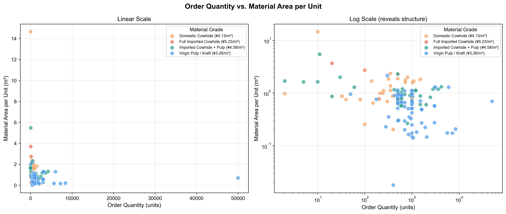
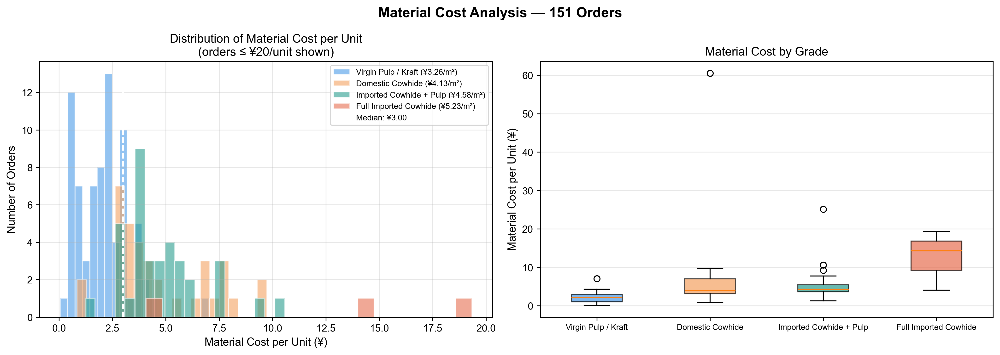
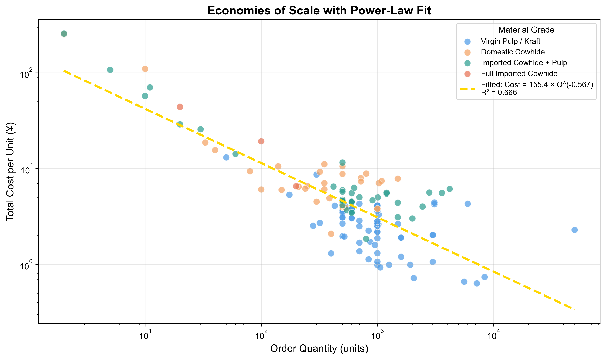
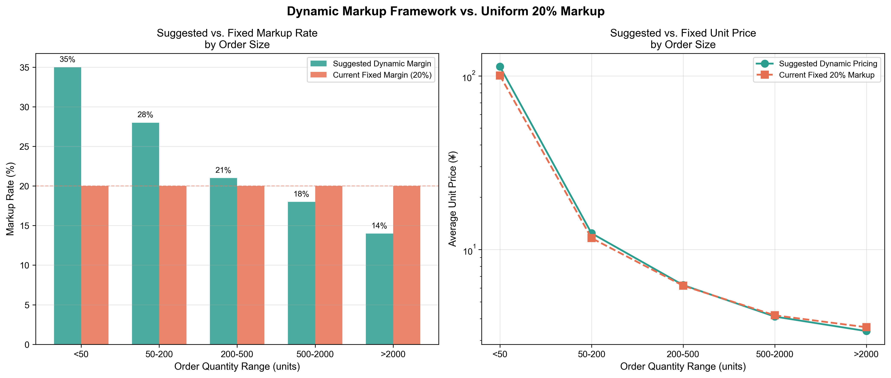

# Cost Structure Analysis and Heuristic Pricing Framework
# for a Small-Scale Custom Corrugated Box Manufacturer

## Overview
This project analyzes three months of production order data from a small
custom corrugated box manufacturer in China to characterize cost structure
and develop a heuristic pricing tool for internal use.

The analysis replaces a uniform 20% flat markup with an order-size-aware
framework grounded in observed economies of scale.

## Data
- 327 total orders; 182 retained after excluding irregular and specialty types
- 4 material grades: Virgin Pulp/Kraft, Domestic Cowhide,
  Imported Cowhide + Pulp, Full Imported Cowhide
- Raw data not included (confidentiality); figures and tool reflect
  cleaned, anonymized outputs

## Key Findings
**Cost structure:** A power-law model fits the relationship between order
quantity and unit cost:

Cost = 155.4 × Q^(−0.567), R² = 0.666

This confirms meaningful economies of scale across the observed order range.

**Pricing framework:** A tiered markup schedule (14%–35%) was derived
heuristically from observed delivery-cost share by order size, replacing
the factory's uniform 20% markup. Parameters are empirically motivated
but not formally optimized — the framework is intended as a practical
decision-support tool, not a theoretical pricing model.

## Figures
| Figure | Description |
|--------|-------------|
|  | Order quantity vs. material area per unit (log scale reveals structure) |
|  | Material cost distribution by grade |
|  | Power-law fit: unit cost vs. order quantity |
|  | Tiered markup vs. uniform 20% baseline |

## Repository Contents
- `analysis.ipynb` — full pipeline: cleaning, EDA, model fitting, visualization
- `tools/pricing_calculator_v2.xlsx` — Excel tool with formula-driven markup lookup
- `figures/` — publication-quality output figures

## Limitations
- No win/loss data available; markup rates are heuristic, not optimization-derived
- Single factory, three-month window; generalizability is limited
- Machine utilization and job-hour data unavailable;
  scheduling analysis was scoped out

## Future Work
- Instrument the factory floor to collect job-hour and machine utilization data
- Use richer dataset to build a formal scheduling or capacity-planning model
- Target venue: Northeast Decision Sciences Institute Annual Meeting, Spring 2027
